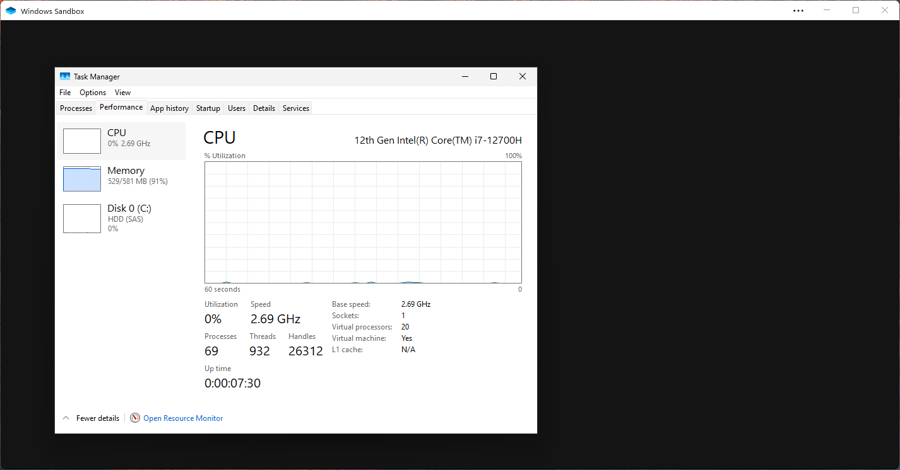

# antbox
## Minimal Windows 11 24H2 Sandbox (581 MB RAM)

This custom `.wsb` configuration launches **Windows 11 24H2** in a sandbox with just **581 MB RAM**.  
It strips out Explorer, Start menu, and other non-essential services for **maximum performance and minimal memory usage**.

### Features

-  No GPU acceleration, audio, networking, or clipboard
-  Kills bloat like `StartMenuExperienceHost`, `TiWorker`, and `ShellExperienceHost`
-  Cleans temp files on startup
-  Boots straight into classic Task Manager

### Image


### Usage
Just download the provided `.wsb` file, and double click it. Make sure you have Windows Sandbox enabled.

### Launch Configuration

<details>
<summary>Click to expand .wsb config</summary>

```xml
<Configuration>
  <vGPU>Disable</vGPU>
  <Networking>Disable</Networking>
  <AudioInput>Disable</AudioInput>
  <VideoInput>Disable</VideoInput>
  <ProtectedClient>Disable</ProtectedClient>
  <ClipboardRedirection>Disable</ClipboardRedirection>
  <MemoryInMB>581</MemoryInMB>
  <LogonCommand>
    <Command>powershell -command "Clear-Content -Path '$env:TEMP\*' -Force"</Command>
    <Command>taskkill /f /im StartMenuExperienceHost.exe</Command>
    <Command>taskkill /f /im ShellExperienceHost.exe</Command>
    <Command>taskkill /f /im explorer.exe</Command>
    <Command>taskkill /f /im TiWorker.exe</Command>
    <Command>taskkill /f /im spoolsv.exe</Command>
    <Command>taskkill /f /im LSalso.exe</Command>
    <Command>taskkill /f /im rdpclip.exe</Command>
    <Command>taskkill /f /im WmiPrsvSE.exe</Command>
    <Command>taskmgr.exe -d</Command>
  </LogonCommand>
</Configuration>
